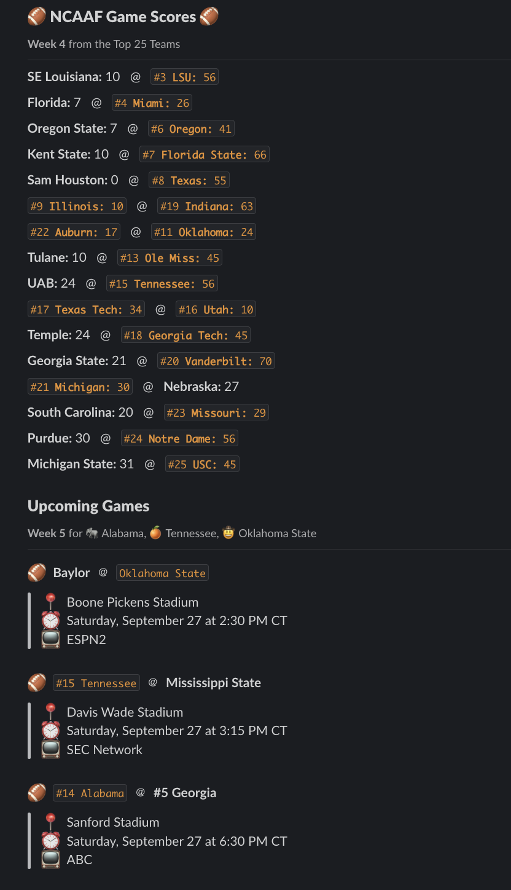

# SportsBall Slack Bot

Automatically post NCAAF scores to Slack. Instructions include deploying and running with Railway.

**Notes:**

- Use the `FAVORITE_TEAMS` variable to set your favorite teams and an emoji to go with them.
- You will need to set your own cron job. I recommend Monday at 9am so that the AP stats from the previous week are available.

## Install

To run locally, you can `npm install` or `yarn`. Then after you complete the Setup instructions below, you can `npm start` or `yarn start` and use the routes outlined in the Usage instructions below.

## Setup

1. Get an API key from [College Football Data API](https://collegefootballdata.com/)
2. Create a [Slack app](https://api.slack.com/apps)
3. Go to the Slack app's "OAuth & Permissions" settings page
4. Add the following scopes: `channels:read` and `chat:write`
5. At the top of that same page, click the button to install the app on your workspace
6. Save the Bot User OAuth Token that generates
7. In your Slack workspace, create the channel you want to post in
8. Open the channel details by clicking the name at the top
9. At the bottom of that modal, copy the channel ID
10. Invite your Slack app/bot to the channel
11. Create a .env file with the following variables:

```
CFBD_API_KEY=your_unique_api_key
SLACK_BOT_TOKEN=your_oauth_bot_token
SLACK_CHANNEL_ID=your_slack_channel
FAVORITE_TEAMS={"Alabama":"🐘","Oklahoma State":"🤠","Tennessee":"🍊"}
```

12. Create a project on Railway
13. Connect the project to your fork of this repo and enable auto deploy
14. Add the variables from step 11 in the worker's Variables tab
15. Add another GitHub connected service and the Vriables there as well
16. Under "Deploy", set the Custom Start Command to `node cron.js`
17. Below that, set the Cron Schedule. For Monday at 9am CST, the schedule is `0 15 * * 1`. For CDT, it is `0 14 * * 1`
18. Deploy both services

## Usage

This will begin running the script and the message will be posted in your Slack channel every Monday at 9am.

To view the output without posting a message to Slack, you can visit your app url in a browser.

- Local app url if running the node server on your machine: `http://localhost:3000`
- Hosted app url is your Railway project's url, e.g. `https://{RAILWAY_NAME}.up.railway.app`

There is also an endpoint to test posting the message. By visiting this URL, a message will post immediately to your Slack channel

- Local: `http://localhost:3000/test`
- Hosted: `https://{RAILWAY_NAME}.up.railway.app/test`

## Preview

This is what the data will look like:

